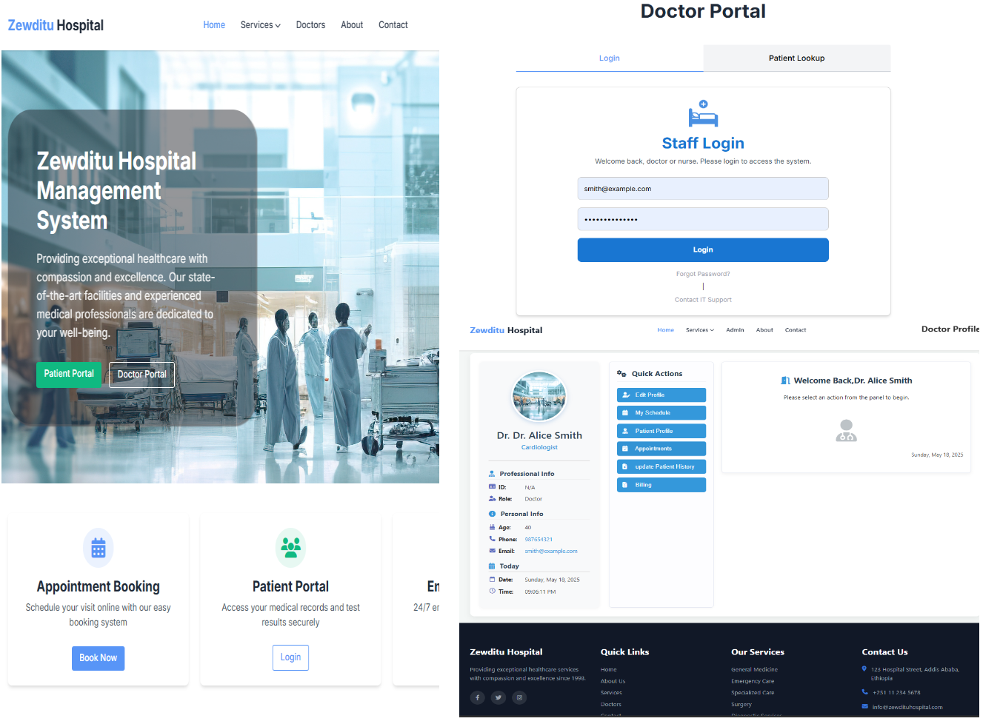

# Doctor Profile Management System

## Instructor Access Shortcut

Dear Instructor, 👋

To save you time during review, you do not need to go through the login or authentication process.
Please use the "For Instructor" button located at the top-right corner of the navigation bar to access your specific section.

or

👉 **Simply open the following file in your browser:**  
`forOurInstructor.html`

✅ This will bypass all authentication and give you direct access to the to review system and its features.

⚠️ **Note:** This shortcut is for instructor use only and is not intended for general access.

# 📋 Overview

The **Doctor Profile Management System** is a modern, responsive web application designed for hospitals and clinics. It empowers healthcare professionals to manage:

- Doctor & staff profiles
- Patient records
- Appointments
- Medical records
- Billing and invoices
- Lab results
- Prescriptions & pharmacy data

> 🏥 This system centralizes hospital operations under one dashboard.

---

## ✨ Key Features

- ✅ Doctor Profile Management
- 👩‍⚕️ Patient Registration and History
- 📅 Appointment Scheduling
- 🧾 Medical & Lab Records
- 💳 Billing and Insurance Tracking
- 💊 Prescription and Pharmacy Management

---

## ⚙️ Technologies Used

- **Frontend**: HTML, CSS, JavaScript
- **Backend**: Node.js
- **Database**: MySQL
- **Hosting**: for local testing

---

## 🛠 System Requirements

- MySQL Server
- Node.js 18+
- Any modern browser
- r local setup

---

## 🔧 Server Information

The main **Express (Node.js)** server file is located at **backend/server/myapp/app.js**

## 🧩 Database Setup Instructions

Database Setup

Before starting the application,
you need to set up the MySQL database with the following schema
